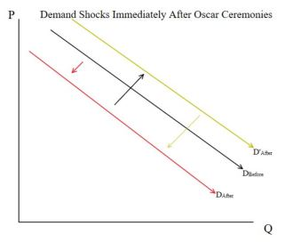

```{r setup, include=FALSE, echo = F, warning = F, message = F}
knitr::opts_chunk$set(echo = TRUE)
library(boxoffice)
library(tidyverse)
library(lubridate)
library(textclean)
library(stargazer)
library(lmtest)
library(orcutt)
library(tseries)
library(sandwich)
```


```{r data fetching and cleaning, echo = F, cache = T, warning =F, message = F}
ceremonyDates <- c("2019/2/24", "2018/3/04", "2017/2/26",  "2016/2/28","2015/2/22", "2014/3/02", "2013/2/24", "2012/2/26", "2011/2/27", "2010/3/07")


#Writing a function that returns the date of the Oscar ceremony when fed in a date object of the same year.
findCeremonyDate <- function(date) 
{
  yearOnly <- year(date)
  for (i in ceremonyDates)
  {
    ifelse((year(i) == yearOnly), return(i), 1)
  }
  return(NULL)
}

awardDates <- c()

for (i in ceremonyDates)
{
  
  dates <- format(seq(from = as.Date(i) - 21, to = as.Date(i) + 21, by = "day"),
                  format="%Y/%m/%d")
  awardDates <- c(awardDates, dates)
}

#Converting dates from strings to actual date objects
awardDates <- as.Date(awardDates)

#The line of code the pulls the data for us
awardSeason <- boxoffice(dates = awardDates) 
 
#filters our awards season data by nominees 

winners <- c("Green Book", "The Shape of Water", "Moonlight", "Spotlight", "Birdman", "12 Years a Slave", "Argo", "The Artist", "The King’s Speech", "The Hurt Locker")
nominees <- c("Green Book", "The Shape of Water", "Moonlight", "Spotlight", "Birdman", "12 Years a Slave", "Argo", "The Artist", "The King’s Speech", "Roma", "The Favourite", "Black Panther", "A Star is Born", "BlacKkKlansman", "Bohemian Rhapsody", "Vice", "Three Billboards Outside Eb…", "Dunkirk", "Lady Bird", "Get Out", "The Post", "Darkest Hour", "Call Me by Your Name", "Phantom Thread", "La La Land", "Manchester-by-the Sea", "Hidden Figures", "Fences", "Arrival", "Hacksaw Ridge", "Hell or High Water", "Lion", "The Revenant", "The Big Short", "The Martian", "Mad Max: Fury Road", "Room", "Bridge of Spies", "Brooklyn", "American Sniper", "Boyhood", "The Grand Budapest Hotel", "The Imitation Game", "Selma", "The Theory of Everything", "Whiplash", "Gravity", "American Hustle", "Dallas Buyers Club", "Her", "Philomena", "The Wolf of Wall Street", "Captain Phillips", "Nebraska", "Lincoln", "Zero Dark Thirty", "Les Miserables", "Life of Pi", "Silver Linings Playbook", "Django Unchained", "Armour", "Beasts of the Southern Wild", "The Help", "The Descendants", "Hugo", "Midnight in Paris", "Moneyball", "The Tree of Life", "War Hoarse", "Extremely Loud and Incredib…", "127 Hours", "Black Swan", "The Fighter", "Inception", "The Kids Are All Right", "The Social Network", "Toy Story 3", "True Grit", "Winter's Bone")

#Grabs the list of best picture nominees and the number of total Academy awards won by them
allNominees <- read.csv("allNominees.csv", header = T) %>% 
  rename(movie = Film) %>% 
  select(movie, Awards)


df <- awardSeason %>%
  mutate(viewership = cut(year(date), breaks = c(2010, 2011, 2012, 2013, 2014, 2015, 2016, 2017, 2018, 2019), labels = c(37.6, 39.3, 40.3, 43.7, 36.6, 34.3, 32.9, 26.5, 29.6))) %>% 
  mutate(viewership = as.numeric(viewership)) %>% 
  mutate(movie = ifelse(movie == "Birdman or (The Unexpected …", "Birdman", movie)) %>% 
  filter(movie %in% nominees) %>%  
  filter(movie != "Black Panther" & movie != "The Grand Budapest Hotel" & movie != "Get Out") %>%  #in theaters during previous award season
  mutate(winner = ifelse(movie %in% winners, 1, 0)) %>% #dummy to denote a winner
  group_by(date) %>% 
  mutate(after = ifelse(date >= findCeremonyDate(date), 1, 0)) %>%  #before or after ceremony
  mutate(daysAfter = ifelse(after ==1, as.Date(date) - as.Date(findCeremonyDate(date)), 0)) %>%  # If after, how many days after
  mutate(friSat = ifelse(wday(date) == 7 | wday(date) == 6, 1, 0)) %>% #Mark if day is weekend
  ungroup() %>% 
  left_join(allNominees, by = "movie") %>% 
  mutate(Awards = ifelse(is.na(Awards), 0, Awards)) %>% 
  arrange(movie) %>% 
  #ungroup() %>% 
  drop_na()

temp <- df %>% 
  filter(percent_change > 500)

model <- lm(percent_change ~ days + viewership:after + friSat + Awards:after + after:winner + after + winner:daysAfter, data = temp)
summary(model)
```
	


```{r checking for autocorrelation, echo = F, warning = F, message = F}
# ACtest <- df %>%
#   group_by(movie) %>%
#   do(model = lm(percent_change ~ days + as.numeric(viewership):after + friSat + Awards:after + after, data = df)) %>%
#   mutate(dstat = dwtest(model)$statistic) %>% 
#   select(movie, dstat)
temp <- df %>% 
  filter(movie == "Spotlight")
temp <- lm(percent_change ~ days + as.numeric(viewership):after + friSat + Awards:after + after, data = temp)
dwtest(temp)
```


##Introduction
The Academy Awards, better known as The Oscars, celebrated their 91st annual award ceremony this past February. There, outstanding achievements in 24 film categories were recognized with the award show’s iconic gold-plated statuettes. While each category honored during the ceremony plays a crucial role in the quality of a film, the most prestigious and coveted award is the Academy Award for Best Picture. The “Best Picture” award is the only Oscar voted on by the entire academy, and its winner is forever memorialized in gold and remembered in film culture. For those highest-up in Hollywood, however, recognition of an artistic endeavour is not the only motivation for an Oscars campaign. As much as the film industry is a place to create and celebrate art, it is still an industry, one that requires increasing revenue as production and promotion budgets rise. 
	The primary way that film studios make (and make back) their money is through box office revenues at movie theaters across the country and around the world. Box office revenue typically exhibits a decay function, where the first weekend is the highest grossing and revenue  falls over the course of the subsequent weeks. This raises the question of whether and how much a Best Picture win changes that function. We would expect the award to be positively correlated with box office revenues, but it’s not clear how much. In this paper, we attempt to determine the added value to box office revenue of a Best Picture Oscar win as compared to nominated films that did not receive the award. 

##Methodology
	The theoretical basis for the question that we pose here is rooted in microeconomic models of consumer demand. If a film is nominated for Best Picture, typical Hollywood studio practice is to begin an often multimillion dollar campaign to garner the influence and visibility necessary to win. In this environment, we believe that we should expect a positive demand-side shock as discerning movie consumers are exposed to advertising and publicity surrounding Best Picture-nominated films. We elected to only compare our Best Picture winners with the other films nominated for the same award in an attempt to control for this Oscar campaign effect. This methodology also helps us to eliminate the need to control for factors such as budget, critical acclaim, and star power on the basis that films nominated for Best Picture should, in general, have similar profiles in these and other similar aspects. Theoretically, all Best Picture nominees would be close enough in profile to exhibit comparable box office revenue decay functions under normal circumstances, so it is easier to measure the second demand shock that occurs for the films that win the award. An Academy Award for Best Picture is the most prestigious film award recognized by the general public, and we predict that a win would cause an outward shift in the demand curve of the winning film and alter its decay function. Not discounting the possibility that a film winning any Oscar could see an increase in demand following the ceremony, we also controlled for number of awards won by each nominee, including winners. 
The most important part of our theoretical model is how we choose our dependant variable, which we define here as a movie’s percent change in revenue from one day to the next. This method allows us to compare films to themselves and therefore further control for many of the important variables which influence a movie’s total box office revenue such as budget, studio, cast, reviews, publicity, and Oscar campaign budget. Additionally, by measuring percent changes in box office revenues as opposed to absolute changes, we control for macro-level factors such as inflation and differences in movie preferences across years. When using daily percentage changes, the most important thing to control for is day of the week. The majority of people go to movies on Friday or Saturday, so those days will always have more positive percent changes than other days. We elect to use a dummy variable to keep track of whether a data point was from before or after the ceremony.  If the “Oscar Bump” does not exist, then we would expect to see no systematic, significant difference between winners and losers in the daily percent change after the ceremony, as compared to their changes before. 
The location of the film in its decay function during the Awards Season is likely to also have an effect on the box office revenues in this time period. If the film is already no longer in theaters during the Awards Season, it is removed from the data on the basis of not being a relevant observation in helping capture the “Oscar Bump” effect. While films that are expected to compete for Best Picture are often released strategically so that they will still be in theaters during the Awards Season, there are still differences in release dates between nominees. This is cause for concern, as the length of time a film has been in theaters is a determining factor in where it is in its decay function. To mitigate this, we control for the number of days that the film had been in theaters. 
Because our analysis takes place over many years, we need to be careful to control for any variables which vary across time periods and would have an effect on our dependant variable, the percent change in box office revenue. One factor that could cause a change in the year-to-year “Oscar Bump” effect is the relative cultural importance of the Oscars. We therefore include the ceremonies’ television viewership as a proxy for the cultural impact of the Oscars in our model. If fewer people watch the awards ceremony, then the ceremony is likely to have less of a cultural impact and therefore any “Oscar Bump” would be smaller.

##Model
	Our model attempts to capture the effect of a Best-Picture win on daily percent change in box office revenue after the ceremony, using box office data from three weeks before the event to train the model. We control for five factors: number of days the film has been in theaters, award show viewership, number of awards won by all nominees, day of the week (Friday, Saturday or otherwise), and whether the percent change time series datum was before or after its pertinent awards ceremony. This approach gives us:
$$SRF: \frac{BOR_t - BOR_{t-1}}{BOR_{t-1}} = D^{After}*D^{Winner} + DaysAfter*D^{Winner}+ D^{After}*Awards + D^{After}*Viewership + D^{After} + Days + D^{FriSat} $$
 The majority of our variables interact with our dummy for whether the data point is before or after the awards ceremony as the effects of winning, viewership, and number of total academy awards won should not be seen before then. We also include the effects of the “after” dummy on its own in order to capture the coefficient for the ceremony as a discrete structural change. The rest of our SRF is consistent with the theoretical model, barring the addition of two variables. The first, “Awards,” is a numeric variable that attempts to capture any increase in consumer demand based on Oscars won other than Best Picture by controlling for the total number of academy awards won by each of the nominees. We could not find sufficiently clean data on the specific awards won by each movie; however, we believe that the number of academy awards won is an acceptable proxy variable for non-best picture “Oscar Bump.” 
The second added variable is “daysAfter,” which is zero in the days before the ceremony and only begins to count up after the awards show occurs. We expect that the “Oscar Bump” will be bigger immediately after the ceremony and then decrease over time. To account for this, we add an interaction term between the dummy variable for whether a movie won best picture and the number of days its been since the awards ceremony. This allows us to determine both the initial “Oscar Bump” and also get an idea of how long this bump lasts.
Data
We decided to use the Oscar ceremonies from 2011-2019 to give us a sufficiently large pool of nominees and winners. This period of time gave us enough data while still staying firmly in the modern Oscar era. We worry that if we included data from from any further back, we would have to worry more about how the Oscars and movie studios attitudes towards the Oscars have changed over time. We retrieved most of our data using the boxoffice package in R. This package allows a user to pull daily box office information from the website The Numbers. This data contains important variables such as percent change in box office revenue from one day to the next and the number of days a movie has been in theaters for every movie in theaters on a given date. Using this package, we were able to pull box office data for 21 days before and after every Oscar Ceremony between the years 2011 and 2019. Our final dataset has 2,313 values, 1,171 before the ceremony and 1,142 after the ceremony. 

```{r Creating Summary Stats, results = 'asis', echo = F, message=F, warning=F} 
table <- df %>% 
   select(percent_change, days, Awards) %>% 
   drop_na()
table <- as.data.frame(table)
 
stargazer(table, title = "Summary Statistics", header = FALSE, type = "latex")
```

There were four noticeable outliers in our data set which contained percent changes of box office revenue above 500%. Upon review, three of these points correspond with large increase theatrical re-releases of movies during Oscar season and the 4th point (and the smallest of the four) seems to nothing more than an extra large weekend box office boost. Therefore we have opted to not remove any of these outliers from the data because they contain relevant information which ought to be included in our model.
Because our data is both time-series within individual movies and cross sectional across years, a traditional Durbin-Watson test across our entire data frame would be ineffective at looking for autocorrelation, as disturbance terms when we switch movies would be incorrectly considered consecutive. To mitigate this problem, we conducted Durbin Watson tests for autocorrelation for individual movies and found that the presence of autocorrelation was minor. 
Due to the limitations in our toolset, we are unable to correct for both autocorrelation and heteroskedasticity in our model. We used a Breusch-Pagan Test to test for heteroskedasticity and found strong results for its presence. We determined that the severity of autocorrelation in our data was outweighed by the degree of heteroskedasticity, so we used the White correction to update the standard errors of the variables in our data. 
```{r visualizations, echo = F, warning = F, message = F}
awardSeason %>% 
  filter(year(date) == "2019") %>% 
  filter(days <10000) %>% 
  filter(percent_change < 500) %>% #For a better graph we removed the outliers
  ggplot(aes(x = days, y = percent_change)) +
  geom_point() +
  labs(x= "Number of Days in Theaters", y = "Percent Change in Box Office Revenue", title = ("Percent Change over Time Spent in Theaters for 2019 Data")) +
  geom_smooth()
```

##Results
```{r testing and correcting Hskedat, results = 'asis' , echo = F, warning = F, message = F}
#testing for H
bptest(model) #Very small p-value so we have H
covarianceMatrix <- vcovHC(model, type = "HC0") #HCO gives White's estimator
finalModel <- coeftest(model, covarianceMatrix)

stargazer(model, title = "Uncorrected Model: Best Picture Oscar Bump", digits = 5, covariate.labels = c("Days in Theater","Weekend vs Weeknight", "After Ceremony","Oscar Viewership","Total Academy Awards Won", "Best Picture Winner", "Oscar Bump Decay"), dep.var.labels = c("Percent Box Office Change"), header = FALSE, type = "latex")


stargazer(finalModel, title = "White-Corrected Model: Best Picture Oscar Bump", digits = 5, covariate.labels = c("Days in Theater","Weekend vs Weeknight", "After Ceremony","Oscar Viewership","Total Academy Awards Won", "Best Picture Winner", "Oscar Bump Decay"), dep.var.labels = c("Percent Box Office Change"), header = FALSE, type = "latex")
```

Our model finds a statistically significant increase in daily box office revenues for films that win an Oscar for Best Picture, as compared to films that were nominated but did not win. This effect is largest immediately following the awards show and drops daily afterwards. Films that were nominated but did not win saw an absolute decrease in daily box office revenues following the ceremony. This means that even when accounting for heteroskedasticity, we find evidence for the existence of our proposed “Oscar Bump,” significant at the 1% level. Our model predicts that the first day after the awards show, a Best Picture-winning film will receive a 21.95% percent increase in Box Office Revenue (BOR) in comparison to non-winning nominees. The “Oscar Bump” is predicted to decay at a rate of 1.93% per day for Best Picture-winners, so the initial boost in daily BOR lessens as we move farther away from the ceremony. It is important to note, also, that all nominees (including winners) had a predicted drop in box office revenue of 14.89%  after the ceremony, which means that the day-after predicted net percent change in BOR for Best Picture winners is an increase of  7.09%. 
Of our other control variables, we find that viewership of the Oscars themselves and total number of Academy Awards won by Best Picture nominees have positive but insignificant effects on percent change in BOR. Although insignificant, we argue in our methodology that their impact is theoretically important, and in particular that Oscar viewership is a sufficient proxy for cultural importance of the Oscars, so it would potentially be correlated with our explanatory variables. Therefore, we feel that not including these variables could introduce omitted variable bias into our model. Furthermore, we find that the coefficients for number of days in theaters and day of the week are positive and significant at the 10% and 1% levels, respectively.
Our “Oscar Bump” is much larger in both magnitude and significance than the positive effect of other Oscars that are not best picture. This supports the hypothesis that the Best Picture Oscar is the most important and has the greatest effect on consumer preferences.
We believe that prior to the ceremony, there is likely a increase in demand for movies nominated for Oscars, particularly for Best Picture, as movie consumers who plan to watch the Academy Awards attempt to see nominees in theaters prior to the ceremony in order to better form opinions and make guesses regarding winners and losers. While this is outside the scope of our econometric analysis, we would expect that there is a positive “Nomination Bump” to the nominated movies immediately after the nominees are announced. Once the awards ceremony occurs, there is a negative demand shock for movie consumption in general, as advertising campaigns and the cultural impact of the Awards Season end. Because of this initial theorized positive shock, we do not expect the negative post-Oscar shock to bring nominated movies down to lower than if the movie had never been nominated at all. This general decrease in demand for movies is captured by our dummy variable for percent changes after the ceremony, and its coefficient agrees with our theoretical argument about demand for films after the ceremony. 
In light of our findings surrounding general consumer demand following the Academy Awards ceremony, the positive coefficient (and its magnitude) for Best Picture winners is particularly impressive. It suggests not only that the positive shock in consumer demand for Best Picture winners exists, but that it is greater in amplitude than the negative demand shock for all nominees(and, by extension, films in general).  

It is important to consider, however, the temporality of this effect. While we expected to see a general decay in box office revenue changes over time, the coefficient on days after the ceremony for winners indicates an additional negative force that pushes the percent changes in box office revenue for winners back towards that of nominees. 

These two shocks, the post Oscar effect and the Best Picture effect can be seen in the graph below. $D_{Before}$ denotes the demand curve for all Best Picture nominees before the awards ceremony. $D_{After}$ shows the negative demand shock that occurs to all movies after the Oscar Ceremony. The shift from $D_{After}$ to $D’_{After}$ represents the positive but temporary shock seen by movies that win Best Picture.

 
	

Conclusions
	It is worth emphasizing that we tested for the increase in percent change in box office revenue for winning an Oscar for Best Picture in comparison to just being nominated for one. If we also wanted to determine the effect of being nominated for a Best Picture Oscar, we would have to find our theorized “Nomination Bump.” With more time, it would benefit our model to be able to quantify our predicted “Nomination Bump” instead of assuming its presence. If we were to compare the decay functions of nominated vs non-nominated films, we would be able to better determine the total effect of a Best Picture Oscar by being able to speak to the nomination effect as well as the winning effect. 
For the purposes of our model, we are also assuming that all of the nominees for best picture received a similar bump in %BOR change when they were nominated. This assumption is theoretically valid, but measuring actual differences in “Nomination Bump” would further help to control for changes to %BOR not stemming from a Best Picture win.
In addition, we attempt to control for the cultural importance of the Oscars across time by including a variable on awards show viewership. While we believe that this is an adequate proxy for cultural importance of the Oscars, there are without a doubt better ways to measure this change cultural relevance, such as social media activity surrounding the Oscars. 
	While we were able to find a significant impact on percent change in daily box office revenue, this econometric analysis is narrow in scope and does not attempt to capture the entirety of the given research question, “how much is a Best Picture Oscar worth?” The value of a Best Picture Oscar is not only expressed in box office revenue, but also in longer-term aspects such as DVD and out of theaters sales; studio, director, producer, and actor notoriety from contributing to a Best Picture; social media and cultural influence, et cetera. With our limited time frame and skill set, we attempted to determine the impact of winning Best Picture on what we determined to be the single greatest contributor to value, box office revenue. 
	
	

